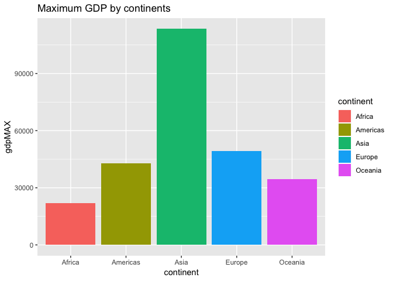
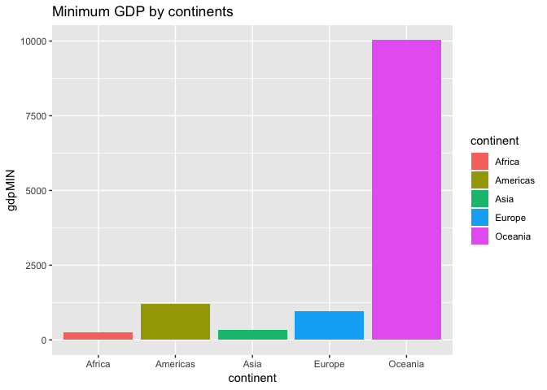
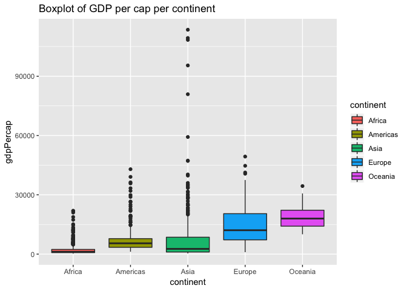
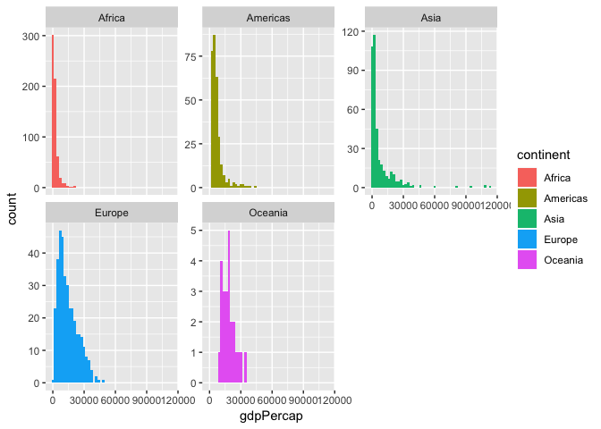
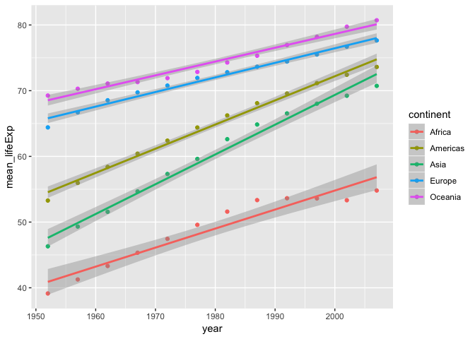
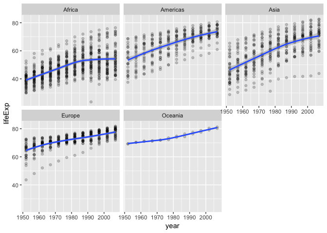

Hw03
================

``` r
suppressPackageStartupMessages(library(tidyverse))
```

    ## Warning: package 'ggplot2' was built under R version 3.4.4

    ## Warning: package 'tidyr' was built under R version 3.4.4

    ## Warning: package 'dplyr' was built under R version 3.4.4

``` r
suppressPackageStartupMessages(library(ggplot2))
suppressPackageStartupMessages(library(gapminder))

suppressPackageStartupMessages(library(kableExtra))
suppressPackageStartupMessages(library(gghighlight))
```

    ## Warning: package 'gghighlight' was built under R version 3.4.4

``` r
suppressPackageStartupMessages(library(gridExtra))
```

**Task 1**

This shows that Asia is the continent with the largest spread in GDP per capita.

``` r
gap_df1 = gapminder %>%
  group_by(continent) %>%
  summarize(gdpMAX = max(gdpPercap), gdpMIN = min(gdpPercap))

gap_df1
```

    ## # A tibble: 5 x 3
    ##   continent  gdpMAX gdpMIN
    ##   <fct>       <dbl>  <dbl>
    ## 1 Africa     21951.   241.
    ## 2 Americas   42952.  1202.
    ## 3 Asia      113523.   331 
    ## 4 Europe     49357.   974.
    ## 5 Oceania    34435. 10040.

``` r
gap_df1%>%
  ggplot(aes(continent, gdpMAX, fill = continent))+
  geom_bar(stat = "identity")+
  labs(title="Maximum GDP by continents")
```



``` r
gap_df1%>%
  ggplot(aes(continent, gdpMIN, fill = continent))+
  geom_bar(stat = "identity")+
  labs(title="Minimum GDP by continents")
```



**Task 2**

``` r
sum_stat = 
  gapminder %>%
  group_by(continent) %>%
  summarize(SD = sd(gdpPercap),
            Mean = mean(gdpPercap),
            Median = median(gdpPercap), 
            Min = min(gdpPercap), 
            Max = max(gdpPercap),
            Qu_1st = quantile(gdpPercap,0.25), 
            Qu_3rd = quantile(gdpPercap, 0.75))
```

    ## Warning: package 'bindrcpp' was built under R version 3.4.4

``` r
sum_stat
```

    ## # A tibble: 5 x 8
    ##   continent     SD   Mean Median    Min     Max Qu_1st Qu_3rd
    ##   <fct>      <dbl>  <dbl>  <dbl>  <dbl>   <dbl>  <dbl>  <dbl>
    ## 1 Africa     2828.  2194.  1192.   241.  21951.   761.  2377.
    ## 2 Americas   6397.  7136.  5466.  1202.  42952.  3428.  7830.
    ## 3 Asia      14045.  7902.  2647.   331  113523.  1057.  8549.
    ## 4 Europe     9355. 14469. 12082.   974.  49357.  7213. 20461.
    ## 5 Oceania    6359. 18622. 17983. 10040.  34435. 14142. 22214.

``` r
gapminder%>%
  ggplot(aes(continent, gdpPercap, fill = continent))+
  geom_boxplot()+
  labs(title="Boxplot of GDP per cap per continent")
```



``` r
gapminder%>%
  ggplot(aes(gdpPercap, fill = continent))+
  facet_wrap(~continent,scale = "free_y")+
  geom_histogram(bins = 50)
```



**Task 3**

Below is presented the interquartile mean, the 25% trimmed mean, of life expectancy arranged by year.

``` r
trimmed_df = gapminder %>%
  group_by(year) %>%  
  summarize(mean_lifeExp = mean(lifeExp), trimmed_mean_lifeExp = mean(lifeExp, trim = 0.25))%>%   arrange(year) 

weighted_df = gapminder %>%
  group_by(year) %>%   
  summarise(mean_lifeExp = mean(lifeExp), weighted_mean_lifeExp = weighted.mean(lifeExp,pop))%>%
  arrange(year)

trimmed_df
```

    ## # A tibble: 12 x 3
    ##     year mean_lifeExp trimmed_mean_lifeExp
    ##    <int>        <dbl>                <dbl>
    ##  1  1952         49.1                 47.3
    ##  2  1957         51.5                 50.3
    ##  3  1962         53.6                 52.8
    ##  4  1967         55.7                 55.4
    ##  5  1972         57.6                 58.1
    ##  6  1977         59.6                 60.5
    ##  7  1982         61.5                 62.7
    ##  8  1987         63.2                 64.8
    ##  9  1992         64.2                 66.2
    ## 10  1997         65.0                 67.3
    ## 11  2002         65.7                 68.3
    ## 12  2007         67.0                 69.7

``` r
weighted_df
```

    ## # A tibble: 12 x 3
    ##     year mean_lifeExp weighted_mean_lifeExp
    ##    <int>        <dbl>                 <dbl>
    ##  1  1952         49.1                  48.9
    ##  2  1957         51.5                  52.1
    ##  3  1962         53.6                  52.3
    ##  4  1967         55.7                  57.0
    ##  5  1972         57.6                  59.5
    ##  6  1977         59.6                  61.2
    ##  7  1982         61.5                  62.9
    ##  8  1987         63.2                  64.4
    ##  9  1992         64.2                  65.6
    ## 10  1997         65.0                  66.8
    ## 11  2002         65.7                  67.8
    ## 12  2007         67.0                  68.9

**Task 4**

The task was solved by making a linear regression line on top of the points to show how life expectancy is changing through the years.

``` r
lifeExp_df = gapminder %>%
  group_by(continent, year) %>%
  summarise(mean_lifeExp = mean(lifeExp))

lifeExp_df %>%
  ggplot(aes(year, mean_lifeExp, color = continent))+
  geom_point()+geom_smooth(method = "lm")
```



``` r
# plot the distribution of each continent.
ggplot(gapminder, aes(year,lifeExp))+
  facet_wrap(~continent)+geom_point(alpha = 0.2)+geom_smooth()
```

    ## `geom_smooth()` using method = 'loess' and formula 'y ~ x'


